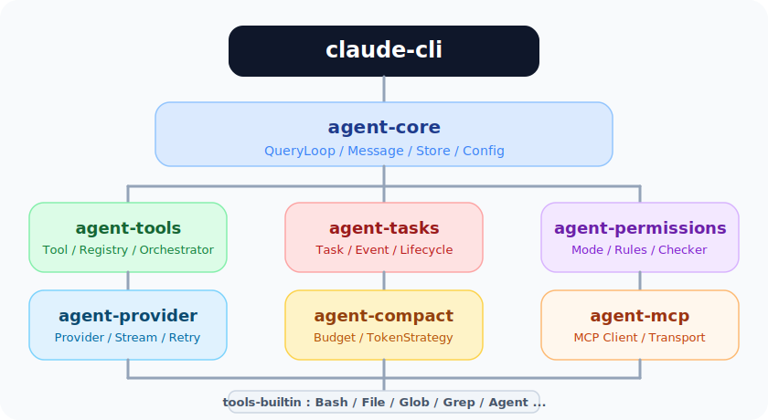
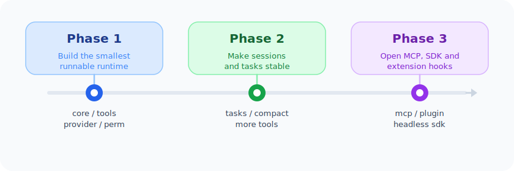

# Claude Code Rust


把 Claude Code 里的核心运行时思路拆出来，用 Rust 重新组织成一组可复用的 crate。

这个项目关心的不是“把 TypeScript 一行一行翻过去”，而是把 agent 真正依赖的那部分能力整理清楚：消息循环、工具调用、权限控制、长任务、上下文压缩、模型接入，以及 MCP 扩展。


## 这个项目是什么

可以把它理解成一个面向 agent 的运行时骨架：

- 上层是一个很薄的 CLI，负责把各个 crate 组装起来。
- 中间是核心运行时，包括消息循环、工具编排、权限、任务和模型抽象。
- 底层是具体能力实现，比如内置工具、MCP 客户端和上下文治理。

如果这些边界划分得足够清晰，那么它不只能服务 Claude 风格的 coding agent，也可以作为别的 agent 系统的基础设施。

## 为什么要重做

Claude Code 的工程质量很高，但它本质上是一个完整产品，而不是一个容易复用的 runtime library。UI、运行时、工具系统和状态管理交织在一起，读源码能学到很多东西，但想把其中一部分单独拿出来复用并不轻松。

这个项目想做的，是把那套已经被验证过的运行时设计重新整理一遍：

- 把大块耦合逻辑拆成职责单一的 crate。
- 把依赖运行时约束的部分改成 trait 和 enum 边界。
- 把“只能在这个项目里工作”的实现，变成“可以被别的 agent 复用”的组件。

## 设计目标

1. **先抽象运行时，再补齐产品层。** 优先把 Agent loop、Tool、Task、Permission 这些基础能力做扎实。
2. **每个 crate 都要能单独理解。** 看名字能猜到职责，读接口能知道边界。
3. **让替换变得自然。** 工具、模型提供方、权限策略、压缩策略都应该能按需替换。
4. **保留 Claude Code 的经验，但不照着 UI 和内部 feature 复刻。**

## 架构总览



| Crate | 作用 | 来自 Claude Code 的哪一层 |
|------|------|------|
| `agent-core` | 消息模型、状态容器、主循环、会话封装 | `query.ts`、`QueryEngine.ts`、`state/store.ts` |
| `agent-tools` | 工具 trait、注册表、执行编排 | `Tool.ts`、`tools.ts`、工具服务层 |
| `agent-tasks` | 长任务生命周期和通知机制 | `Task.ts`、`tasks.ts` |
| `agent-permissions` | 工具调用授权与规则匹配 | `types/permissions.ts`、`utils/permissions/` |
| `agent-provider` | 模型统一接口、流式处理、重试 | `services/api/` |
| `agent-compact` | 上下文裁剪与 token 预算控制 | `services/compact/`、`query/tokenBudget.ts` |
| `agent-mcp` | MCP 客户端、连接、发现与重连 | `services/mcp/` |
| `tools-builtin` | 内置工具实现 | `tools/` |
| `claude-cli` | 可执行入口，负责组装全部 crate | CLI 层 |

## 这些模块分别解决什么问题

### `agent-core`

负责一轮对话怎么开始、怎么继续、什么时候停止。这里会定义统一的消息模型、主循环和会话状态，是整个系统的底座。

### `agent-tools`

负责“工具长什么样”和“工具如何被调度”。Rust 版会避免把所有上下文都塞进一个巨大的对象里，而是按职责拆开，让工具只拿到它真正需要的部分。

### `agent-tasks`

负责后台任务。这个模块很重要，因为只有把 tool call 和 runtime task 分开，才容易支持长命令、后台 agent 和任务完成后的通知回灌。

### `agent-permissions`

负责授权模型能做什么、什么时候必须问用户、什么时候要直接拒绝。只要 agent 会读文件、写文件或执行命令，这一层就绕不开。

### `agent-provider`

负责屏蔽不同模型后端的差异，统一流式输出、重试和错误恢复逻辑。

### `agent-compact`

负责长会话稳定性。不是简单做“摘要”，而是根据场景做不同层次的压缩和预算控制，避免上下文无限增长。

### `agent-mcp`

负责接入外部 MCP 服务，把远程 tool、resource、prompt 纳入统一的能力面。

### `tools-builtin`

负责最常用的内置工具，优先级会放在文件、命令、搜索和编辑这些 agent 的基本操作上。

## 和 TypeScript 版相比，Rust 版会更强调什么

| TypeScript 版常见做法 | Rust 版对应思路 |
|------|------|
| 大量运行时判断 | 尽量前移到类型系统里 |
| 容易膨胀的上下文对象 | 拆成更小的 context / trait 边界 |
| 分散的 callback 和 event | 尽量统一成更连续的事件流 |
| 运行时 feature 开关 | 能在编译期裁剪的尽量编译期处理 |
| UI 和运行时耦合较深 | 优先把 runtime 独立出来 |

这不是说 Rust 一定更“高级”，而是它更适合把运行时边界钉死。对于一个长期演进的 agent 系统来说，这样的约束通常是有价值的。

## 实现路线



### Phase 1：先跑起来

- 建立 `agent-core`、`agent-tools`、`agent-provider`、`agent-permissions`
- 先实现最基础的 `Bash`、`FileRead`、`FileWrite`
- 提供一个最小可运行的 CLI

目标是先得到一个能对话、能调工具、能执行命令和读写文件的基础版本。

### Phase 2：把会话做稳

- 加入 `agent-tasks`，支持后台任务与通知
- 加入 `agent-compact`，解决长会话和大结果处理
- 扩展 `tools-builtin`，补齐编辑、搜索和子 agent 能力

目标是让 session 可以持续更久，不因为输出过大或任务过长而变得脆弱。

### Phase 3：把边界打开

- 接入 `agent-mcp`
- 补更完整的插件/技能加载能力
- 支持更适合嵌入式场景的 SDK / headless 用法

目标是让它不只是一个 CLI，而是一套可以集成进别的系统里的 agent runtime。

## 目录结构

当前仓库里最重要的文件不多：

```text
rust-clw/
├── README.md
├── ARCHITECTURE.zh-CN.md
└── docs/
    └── assets/
        ├── overview.svg
        ├── architecture.svg
        └── roadmap.svg
```

等各个 crate 真正落地之后，这里会继续展开成一个 Rust workspace。


## 参考

- [ARCHITECTURE.zh-CN.md](./ARCHITECTURE.zh-CN.md)：对 TypeScript 版 Claude Code 的拆解笔记
- [Claude Code 官方文档](https://docs.anthropic.com/en/docs/claude-code)
- [Model Context Protocol](https://modelcontextprotocol.io/)

## License

MIT
